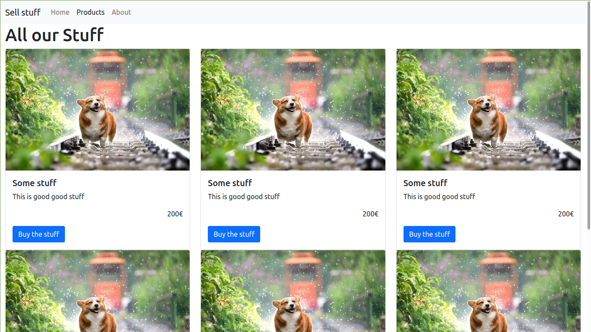

# Formation HTML/CSS

Dépôt avec les exercices et exemples pour la formation HTML/CSS de septembre 2024

## Structures [html](first.html)
Quelques exemples de balises HTML. Pour avoir une liste documentée à jour, [la doc de mozilla](https://developer.mozilla.org/fr/docs/Web/HTML/Element) est très bien.

À retenir surtout, on utilise le HTML pour structurer nos documents, structurer de manière logique pour indiquer aux lecteurs d'écrans, aux robots ou autre, ce que représentent les différents blocks et données de notre page.

Pour ça depuis le HTML5 on aura en plus comme outils les (balises sémantiques)[https://developer.mozilla.org/fr/docs/Glossary/Semantics#les_%C3%A9l%C3%A9ments_s%C3%A9mantiques] qui vont permettre d'utiliser des blocs avec un sens plutôt que des div.

### Les div et span
Ces éléments HTML n'ont presqu'aucun effet et aucune valeur sémantique par eux même. Dès lors, lorsqu'on crée une structure logique, il n'y a pas de raison de les utiliser. Ça ne veut pas dire que leur utilisation est proscrite ou inutile, bien au contraire, il faudra juste réserver leur utilisation pour : faire du CSS (par exemple dans le cas où on veut faire un style css complexe qui nécessite plusieurs éléments html, mais sans pour autant qu'on souhaite modifier notre structure sémantique) ou faire du Javascript (si on veut rajouter des interactions ou autre sans modifier la structure sémantique)

## Créer une structure à partir d'une maquette

En se basant sur la maquette ci-dessus, l'idée est de créer une [structure HTML](exo-structure.html) pure sans penser au style ou à l'apparence, mais en se concentrant sur ce que représente sémantiquement les différents blocs

## Exercice Selectors ([html](exo-selector.html)/[css](css/exo-selector.css))
1. Créer une balise section avec un id "first" qui contiendra un h1 avec First Section dedans
2. Dans la section créer un paragraphe avec "some text" dedans qui aura également une balise span avec une classe "highlight"  et comme contenu " and important text"
3. Dans le fichier CSS sélectionner le h1 à l'intérieur de la section first et mettre sa couleur en bleu et le mettre en gras
4. Ensuite, sélectionner la classe highlight et mettre sa couleur de fond en jaune et mettre son texte en italique
5. Dans le HTML, créer un nouveau paragraphe et lui mettre la  classe highlight et comme contenu "another paragraph", ainsi qu'un autre span avec la classe highlight dessus et " with more important text" comme contenu
6. Dans le css, faire une règle pour que les classe highlight à l'intérieur d'une classe highlight ait leur texte en bleu
7. Créer une nouvelle règle css qui mettra une bordure en pointillés autour des paragraphes qui sont dans un article (pour fêter ça,  faire un article avec un paragraphe dedans)
8. Mettre un h2 dans l'article puis faire une règle qui change la taille du texte des h2 pour 0.5em et tout en majuscule 

## Ressources

* Pour les différentes propriétés CSS et des aides visuel, une [CSS Cheatsheet](https://htmlcheatsheet.com/css/)
* [Petite aide visuelles](https://simplonlyon.gitlab.io/P9/css-exercices/position.html) pour voir comment interagissent les différents positionnements ensembles et avec les marges et tout
* Pour les flexbox, le petit jeu [flexbox froggy](https://flexboxfroggy.com/) est très bien
* Dans la même veine que les grenouille, il y a le [grid garden](https://cssgridgarden.com) pour le display grid

